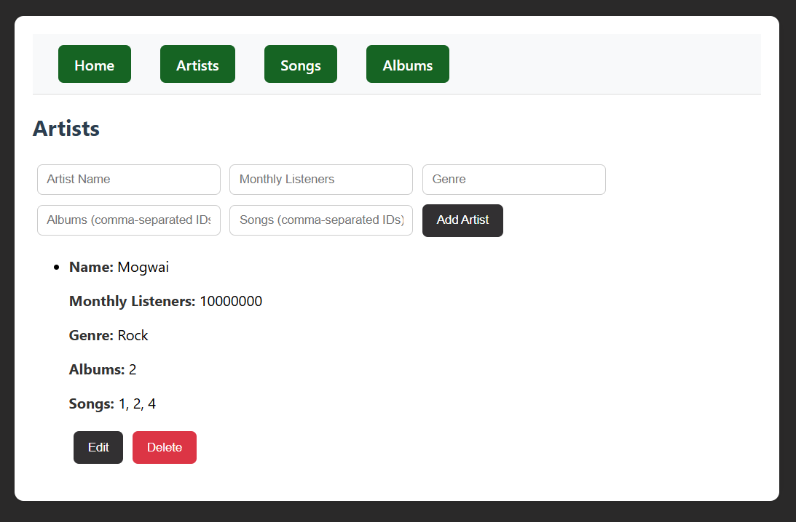

# 🎵 Music Project

A full-stack music app built using React (frontend) and Node.js/Express with MariaDB (managed via phpMyAdmin) on the backend. This project demonstrates my ability to create, connect, and deploy both client- and server-side components of a dynamic web application.



---

## 🚀 Features

- 🎧 Browse and view albums, artists, and songs
- 🔍 Dynamic routing and component-based UI (React)
- 🎯 RESTful API backend using Node.js and Express
- 🗃️ MariaDB database managed with phpMyAdmin
- 🔄 Axios for API communication
- 🎨 Styled with CSS

---

## ⚙️ How to Run It

### 🔧 Prerequisites
- Node.js & npm
- MariaDB and phpMyAdmin installed (or running via something like XAMPP)

---

### ▶️ Running the Backend

```bash
cd music_backend
node server.js

### ▶️ Running the Frontend

cd music_frontend
npm install
npm run dev